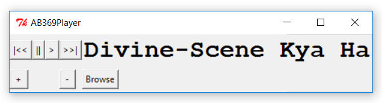
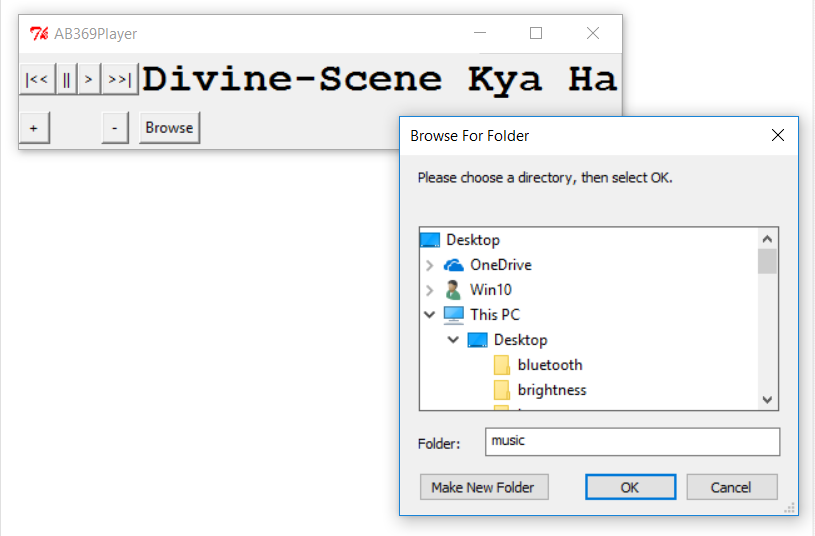

# mp3player
A basic mp3 player 
## Language Used
Python 2.7
## Dependencies
* Tkinter
* pygame

## Features
* browse a directory in which songs are kept
* common buttons of a mp3 player(play,stop,next track,previous track)
* volume up and down buttons

## Future Developments
* better GUI design

## Screenshots
### Shows name of Artist and the Track  

### We can now browse folders where .mp3 files are kept from the UI

